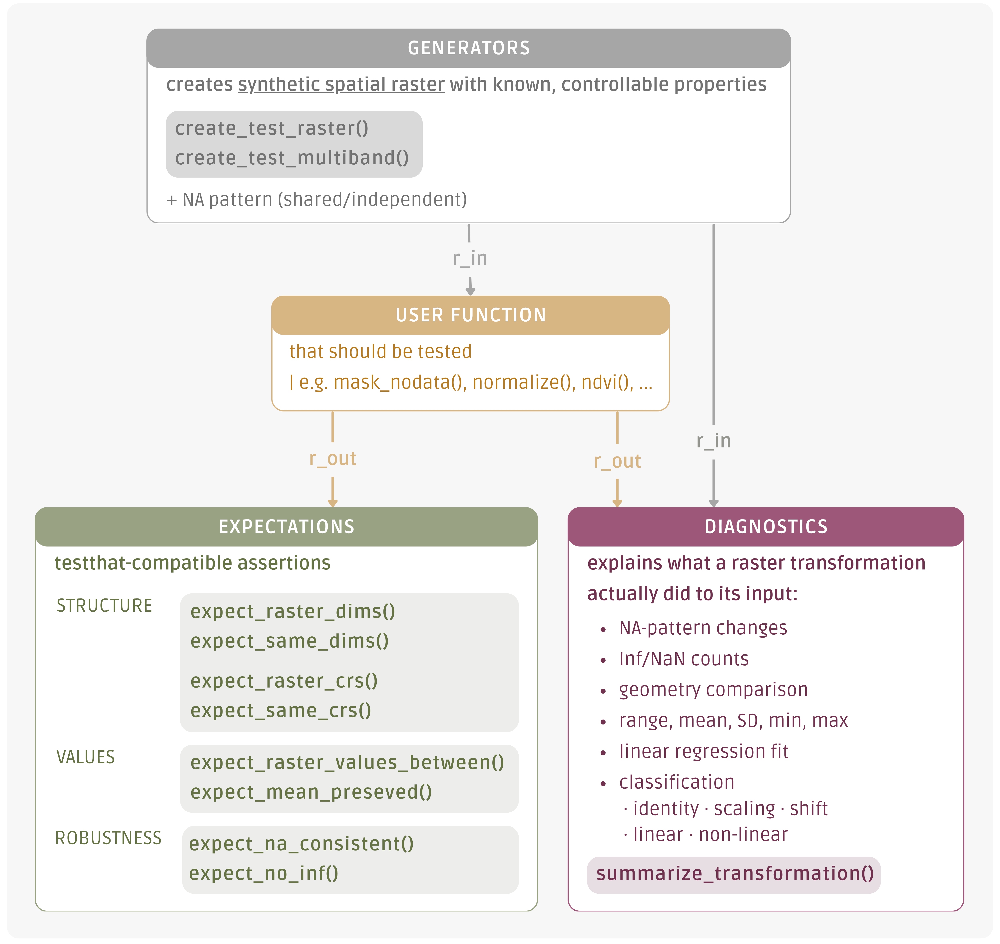
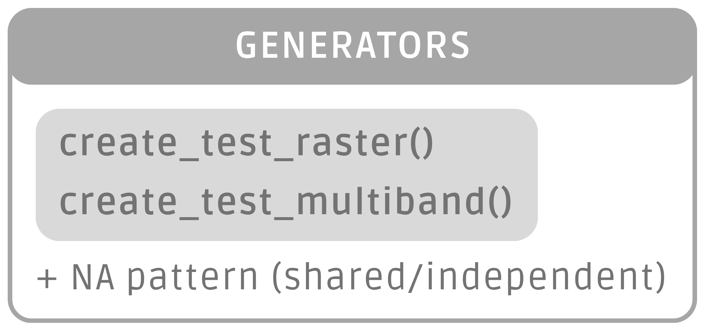
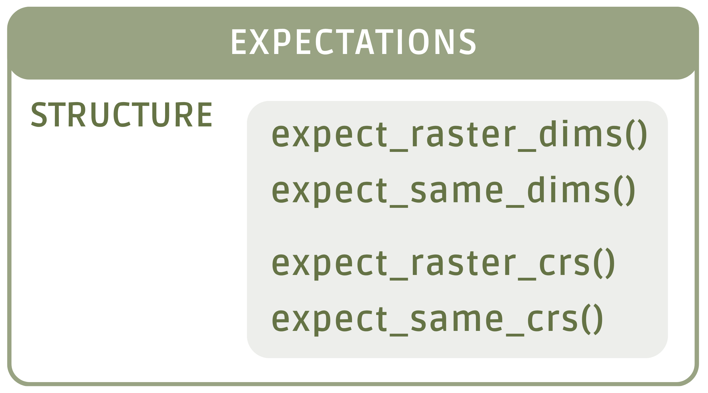
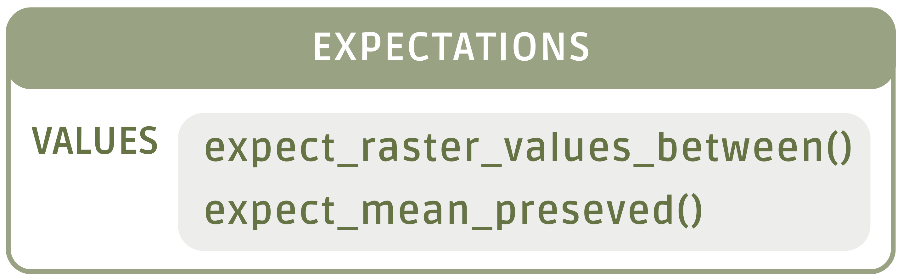
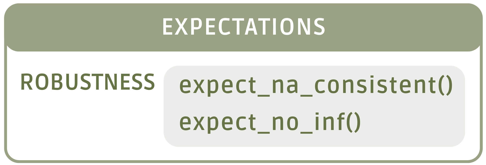
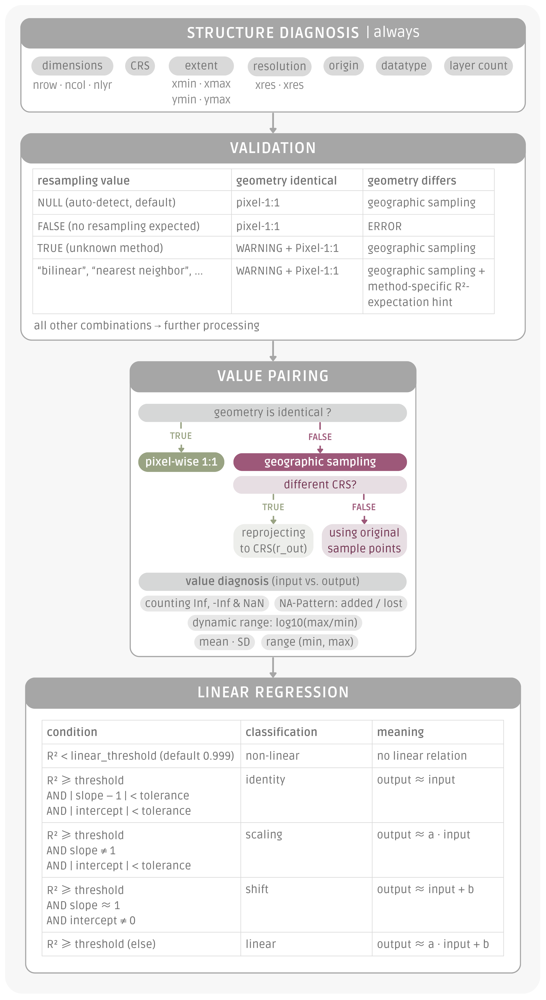

# spatialtestR 

`testthat` made unit testing in R something people actually do. `spatialtestR` is the same idea for `terra::SpatRaster`. **Did your raster function actually do what you meant?**

> Unit testing remains uncommon in geospatial science. Raster pipelines are typically validated through visual inspection of the output map; adequate when each line of code is written by hand. But now that AI assistants generate increasing portions of the code and results that look plausible yet are numerically incorrect, that isn't enough anymore.
>
> As a `testthat`-compatible API, `spatialtestR` provides the missing testing functions for `terra::SpatRaster` workflows: by **collecting** **all mismatches into one readable error** and telling you *what your transformation actually did to the pixel values* it makes systematic verification as routine as inspecting the map.

`spatialtestR` provides four families of helpers for unit-testing raster-processing functions:



------------------------------------------------------------------------

# Installation

``` r
# installing devtools
install.packages("devtools")

# installing package
devtools::install_github("jule-svg/spatialtestR", build_vignettes = TRUE)

# loading and trying
library(spatialtestR)
?create_test_raster        # Hilfeseite öffnet sich
vignette("spatialtestR")   # Vignette öffnet sich im Browser
```

------------------------------------------------------------------------

# A worked-through use case: Sentinel-1 SAR

This example tests functions that process Sentinel-1 VH backscatter (in dB) in a typical preprocessing chain (from a snow-on-runoff workflow):

- mask `-9999` NoData values
- remove bottom-noise pixels below `-35 dB`
- apply a speckle filter
- aggregate or resample
- compute a derived index (wet-snow detection)

> **Looking for the full workflow?** This section walks through representative test snippets. For the complete, executable Sentinel-1 tutorial with every preprocessing step tested, see the package vignette: `vignette("spatialtestR")`.

------------------------------------------------------------------------

## Quick example

You've written `mask_nodata()` for Sentinel-1, that should convert `-9999` to proper `NA`:

``` r
library(spatialtestR)
library(terra)

# build a synthetic SAR-like raster: half NoData, half real backscatter (dB)
r_in <- create_test_raster(nrow = 20, ncol = 20,
                           crs  = "EPSG:32632",
                           values = c(rep(-9999, 200), rep(-15, 200)))   

r_out <- mask_nodata(r_in, nodata = -9999)

# testing / assertions
expect_same_dims(r_in, r_out)                  # shape preserved
expect_same_crs (r_in, r_out)                  # CRS preserved
expect_raster_values_between(r_out, -35, 5)    # plausible VH range in dB
expect_no_inf(r_out)                           # no division-by-zero artefacts
```

------------------------------------------------------------------------

## The four function families

### 1. Generators 

Building deterministic `SpatRaster` objects with known properties, so you have a controlled input for the function you're testing.

#### `create_test_raster()`

> creates a single-band raster with full control over dimensions, CRS, extent, cell values, and NA placement

| argument | description |
|----|----|
| `nrow`, `ncol` | dimensions of the raster; defaults to 10 × 10 × 1 |
| `crs` | CRS as EPSG code or WKT; default `"EPSG:4326"` |
| `xmin`, `xmax`, `ymin`, `ymax` | spatial extent |
| `values` | cell values: `NULL` (default → sequence `1..n_cells`), a scalar (constant fill), or a vector (recycled) |
| `na_fraction` | fraction of cells to set to `NA`, in `[0, 1]` |
| `seed` | optional random seed for reproducible NA placement |

**Output**: a `terra::SpatRaster` with the requested geometry and values. No internal randomness leaks unless you ask for NAs.

**Use case**: when you want to test a function with a *predictable* input. E.g. for SAR you might fix the value at `-15 dB`, then check that your speckle filter produces an output where most pixels are still close to `-15 dB` but a controlled amount of NAs are introduced at the borders.

``` r
# Minimal: 10×10 raster filled with values 1..100, EPSG:4326
r <- create_test_raster()

# Realistic SAR fixture: 20×20 VH backscatter in dB, UTM zone 32N
r <- create_test_raster(
  nrow = 20, ncol = 20,
  crs  = "EPSG:32632",
  xmin = 300000, xmax = 320000,
  ymin = 5000000, ymax = 5020000,
  values      = -15,      # constant backscatter in dB
  na_fraction = 0.1,      # 10% missing (e.g. layover/shadow)
  seed        = 42        # reproducible NA placement
)
```

#### `create_test_multiband()`

> creates a multi-band raster with named layers; essential for testing spectral-index functions (NDVI, NDWI) or polarisation-pair operations (VV/VH ratio)

| argument | description |
|----|----|
| `band_names` | character vector of layer names; default `c("blue", "green", "red", "nir")`; number of layers equals `length(band_names)` |
| `band_values` | named list with one entry per band; names must match `band_names`; default `NULL` fills each band with the sequence `1..n_cells` |
| `na_pattern` | default: `"independent"` (each band has its own NA placement); or `"shared"` (all bands have NAs in the same positions) |

*All other arguments (`nrow`, `ncol`, `crs`, `xmin`/`xmax`/`ymin`/`ymax`, `na_fraction`, `seed`) work exactly as in `create_test_raster()`.*

``` r
# Minimal: 4-band default (blue, green, red, nir)
ms <- create_test_multiband()

# Realistic SAR fixture: 20×20 multiband, VH + VV bands, UTM zone 32N
ms <- create_test_multiband(
  nrow = 20, ncol = 20,
  crs  = "EPSG:32632",
  xmin = 300000, xmax = 320000,
  ymin = 5000000, ymax = 5020000,
  band_names  = c("VH", "VV"),
  band_values = list(VH = rep(-15, 400),    # 400 = 20 × 20
                     VV = rep(-8,  400)),
  na_fraction = 0.1,                        # 10% missing per band
  na_pattern  = "shared",                   # cloud-like NA pattern
  seed        = 42                          # reproducible NA placement
)
```

------------------------------------------------------------------------

**`NA-pattern`: cloud-like vs. sensor-like missing data**

> real multiband data has two distinct categories of missingness: `shared` and `independent`

`create_test_multiband()` simulates both via the `na_pattern` argument

``` r
# "shared": every band has NAs in the SAME pixel positions
# Realistic model: cloud masks for optical data, layover/shadow for SAR
ms_cloud <- create_test_multiband(
  na_fraction = 0.2,
  na_pattern  = "shared",
  seed        = 42
)

# "independent": every band has its OWN NA pattern
# Realistic model: per-band sensor dropouts, multi-acquisition fusion
ms_sensor <- create_test_multiband(
  na_fraction = 0.2,
  na_pattern  = "independent",
  seed        = 42
)
```

**Why this matters for testing**: a function like `compute_vv_vh_ratio()` behaves correctly under cloud-shared NAs (output NA wherever either band is NA) but breaks under independent NAs (where do you put the NA when only VH is missing?).

------------------------------------------------------------------------

### 2. Expectations: Structure 

Checking the *form* of the raster: dimensions, layer count, and CRS.

#### `expect_raster_dims(r, nrow, ncol, nlyr)`

> proofs that a raster has the expected number of rows, columns, and/or layers; any argument left `NULL` is skipped

``` r
# all three checked
expect_raster_dims(r, nrow = 20, ncol = 20, nlyr = 1)

# only check layer count (useful after band reductions like NDVI)
expect_raster_dims(r, nlyr = 1)
```

**Methodology**: each dimension is checked separately. If multiple dimensions are wrong, all mismatches are collected into a single error message.

**Use case**: e.g. after resampling to ensure the resolution change took effect.

#### `expect_raster_crs(r, crs)`

> proofs that a raster has the expected CRS; accepts both EPSG strings and full WKT

``` r
# via EPSG code (case-insensitive)
expect_raster_crs(r, "EPSG:32632")
expect_raster_crs(r, "epsg:32632")

# via WKT (e.g. from another raster)
wkt <- terra::crs(r)
expect_raster_crs(r, wkt)
```

**Methodology**: comparison is delegated to `terra::same.crs()`, which normalises both representations internally

**Use case**: e.g. after terrain-flattening (which under the hood reprojects via DEM), this guards against accidental CRS drift: UTM 32N going in, UTM 32N coming out

#### `expect_same_dims(r_in, r_out)` and `expect_same_crs(r_in, r_out)`

> compare an *input* raster with the *output* of a function

``` r
r_in  <- create_test_raster(nrow = 20, ncol = 20, crs = "EPSG:32632")
r_out <- speckle_filter(r_in, size = 5)

# the filter should NOT change geometry
expect_same_dims(r_in, r_out)
expect_same_crs (r_in, r_out)
```

**When to use which?**

- `expect_same_*()` when you want the output to match the input (without hard-coding the input's dimensions or CRS; more flexible, reads more naturally)

  > `expect_same_dims()` also checks `nlyr`: if you're testing *multi-band → single-band reduction* (NDVI, PCA), compare against a single layer of the input: `expect_same_dims(r_in[[1]], r_out)`

- `expect_raster*()` when you have a *fixed* expected value (e.g. you assert the output is `15×15`)

------------------------------------------------------------------------

### 2. Expectations: Value 

Checking the actual numeric content: *are the pixel values plausible?*

#### `expect_raster_values_between(r, lower, upper)`

> proofs that all non-NA cell values lie within `[lower, upper]` (inclusive);\
> NAs are ignored (a missing value is not a "wrong" value)

``` r
# typical SAR VH backscatter range
expect_raster_values_between(r_db, lower = -35, upper = 5)

# normalized indices (NDVI, NDWI)
expect_raster_values_between(r_ndvi, lower = -1, upper = 1)
```

**Methodology**: filters out NAs, then computes `min()` and `max()` on the remaining values. If observed *min \< lower* or observed *max \> upper*, the error message reports both the requested bounds and the actually observed range.

**Use case**: e.g. after a dB conversion, all values should sit in `[-35, +5]`. If a few cells are `-Inf`, this assertion catches it.

#### `expect_mean_preserved(r1, r2, tolerance)`

> proofs that the mean of two rasters is identical, within a tolerance; useful for checking that an operation introduces *no systematic bias*.

``` r
r_in  <- create_test_raster(values = -15)
r_out <- speckle_filter(r_in, size = 5)
expect_mean_preserved(r_in, r_out, tolerance = 0.01)
```

**Methodology**: computes `mean(values, na.rm = TRUE)` on both rasters and checks the absolute difference against `tolerance` (default is `1e-6`, suitable for lossless operations).

**Use case**: e.g. an idealised speckle filter should preserve the *mean* of an extended homogeneous region (even though individual pixel values are smoothed). If the mean shifts by more than 0.01 dB, something more than smoothing is happening.

------------------------------------------------------------------------

### 3. Expectations: Robustness 

Checking that values stay sane after a transformation.

#### `expect_na_consistent(r1, r2)`

> proofs that two rasters have `NA` *in exactly the same cells*. The error message distinguishes between two directions:
>
> - NAs lost (in r1 but not r2)
>
> - NAs added (in r2 but not r1)

``` r
r_in  <- create_test_raster(na_fraction = 0.1, seed = 1)
r_out <- to_db(r_in)
expect_na_consistent(r_in, r_out)   # to_db should not add or remove NAs
```

**Methodology**: builds boolean NA masks for both rasters and counts disagreements in each direction separately. The error message looks like `NA pattern differs in 12 cells: 8 are NA in r1 but not in r2, 4 vice versa.`

**Use case**: e.g. after a `to_db()` conversion (`10*log10()`), the NA pattern should be unchanged. If your implementation calls `log10(0)`, you'll get a new `-Inf` (not an NA, so this passes), but `to_db()` of an NA should still be an NA. This assertion catches it if the implementation accidentally drops NAs.

#### `expect_no_inf(r)`

> proofs that a raster contains no `Inf` or `-Inf` values, counting each direction separately.

``` r
r_log <- log(r_in)            # log(0) = -Inf
expect_no_inf(r_log)          # fails if any cell was 0
```

**Methodology**: counts `Inf` and `-Inf` occurrences separately, both reported in the error message.

**Use case**: e.g. `to_db(x) = 10 * log10(x)`. If your masking step doesn't catch a pixel equal to 0, you get `-Inf` instead of `NA` (common bug in SAR-preprocessing).

------------------------------------------------------------------------

### 4. Diagnostics: `summarize_transformation()` 

Answers a different question: **"what is this transformation actually *doing*?"**

> runs a structural diagnosis (geometry, NAs, value ranges) plus a regression-based classification (`output ~ input`) and gives you a single printable report.

``` r
r_in  <- create_test_raster(values = 1:100)
r_out <- r_in * 2 + 5

summarize_transformation(r_in, r_out)
#>
#> Raster transformation summary
#> =============================
#>
#> Geometry
#>   dimensions:    10 x 10 x 1   ->   10 x 10 x 1   [same]
#>   CRS:           EPSG:4326     ->   EPSG:4326     [same]
#>   extent:        [0, 1] x [0, 1]   ->   [0, 1] x [0, 1]   [same]
#>   resolution:    0.1 x 0.1     ->   0.1 x 0.1     [same]
#>
#> Sample
#>   method:        pixel-wise 1:1
#>   used:          100 paired values
#>   resampling:    auto-detect
#>
#> Values  (input -> output)
#>   range:         [1, 100]      ->   [7, 205]
#>   mean:          50.5          ->   106
#>   sd:            29            ->   58
#>
#> NA / Inf / NaN
#>   NA:            0 in input   ->   0 in output   (added 0, lost 0)
#>
#> Linear fit  (output ~ input)
#>   slope:         2
#>   intercept:     5
#>   R^2:           1    (100 valid pairs)
#>   ->             LINEAR (affine) (output approx 2 x input + 5)
```

**How it works methodically**

The function follows a four-step decision flow:

1.  **structural diagnosis**: compares dimensions, CRS, extent, resolution, datatype, layer count
2.  **pair the values**: if geometry is identical, *pixel-wise 1:1*; if geometry differs (resampling), random geographic sampling *within the overlap*
3.  **value-level summary**: range, mean, SD, NA changes, Inf/NaN counts
4.  **linear regression**: fits `lm(output ~ input)` and classifies into one of five categories



The thresholds for "≈" and "≥" are configurable via `tolerance` (default `1e-6` for slope/intercept) and `linear_threshold` (default `0.999` for R²).

| argument | description |
|----|----|
| `r_in`, `r_out` | the two rasters to compare: `r_in` is the input; `r_out` is the function's result |
| `resampling` | what the user knows about resampling: `NULL` (auto-detect from geometry), `FALSE` (assert no resampling, error if geometries differ), `TRUE` (resampling happened, method unspecified), or a method string (see below) |
| `n_sample` | maximum number of points used when geographic sampling is needed (default 10 000) |
| `seed` | random seed for reproducible sampling |
| `tolerance` | numeric tolerance for slope-vs-1 and intercept-vs-0 in the classification (default `1e-6`) |
| `linear_threshold` | minimum R² for "linear"; below this, the transformation is classified as `non_linear` (default `0.999`) |

**`resampling` argument in detail:**

| value | meaning |
|---------------------------------------------------------------------|------------------------------------|
| `NULL` (default) | auto-detect |
| `FALSE` | "No resampling expected" |
| `TRUE` | "Resampling happened, method unspecified" |
| `"nearest_neighbor"` (or `"nearest"`, `"ngb"`, `"nn"`) | specific method |
| `"bilinear"` (or `"linear"`) | specific method |
| `"cubic"` (or `"bicubic"`) | specific method |
| `"lanczos"` | specific method |
| `"mode"` (or `"majority"`) | specific method (categorical) |
| `"average"` (or `"mean"`, `"aggregate"`) | specific method |


**Use case 1: was the speckle filter linear?**

``` r
r_in  <- create_test_raster(nrow = 50, ncol = 50,
                             values = rnorm(2500, mean = -15, sd = 3))
r_out <- speckle_filter_median(r_in, size = 5)

summarize_transformation(r_in, r_out)
```

> a correct median filter on a fairly noisy backscatter raster typically produces `R² ≈ 0.85–0.95` (lots of variance, but the broad trend follows the input). If you see `R² ≈ 0.999, slope = 1, intercept = 0` (classification `identity`), your filter isn't actually filtering.

**Use case 2: was the resampling lossless enough?**

``` r
r_in  <- create_test_raster(nrow = 50, ncol = 50)
r_agg <- terra::aggregate(r_in, fact = 2, fun = "mean")

summarize_transformation(r_in, r_agg, resampling = "average")
#> ...
#> Sample
#>   method:        random geographic sampling
#>   resampling:    average
#>
#> Resampling hint (average)
#>   expected R^2:  0.92 - 0.99
#>   observed R^2:  0.97   -> within expected range
```

> the method-aware hint tells you whether your observed R² falls in the *expected* range for that resampling method, so you don't accidentally read `R² = 0.97` as bad.

**Use case 3: catching an unintentional resampling**

``` r
# you THINK your function preserves geometry, but secretly resamples
summarize_transformation(r_in, r_out, resampling = FALSE)
#> Error: You specified `resampling = FALSE`, but the geometries of
#> `r_in` and `r_out` differ:
#>   dimensions: 50x50x1 (in)  vs  25x25x1 (out)
#> Did you forget about an upstream resample/project/aggregate step?
```

> `resampling = FALSE` turns a silent bug into a loud error

------------------------------------------------------------------------

## Summary of Functions

| function | family | what it does |
|----|----|----|
| `create_test_raster()` | generators | single-band test SpatRaster with controllable dims, CRS, values, NAs, seed |
| `create_test_multiband()` | generators | multi-band SpatRaster with named layers and `na_pattern` (`shared` / `independent`) |
| `expect_raster_dims()` | structure | proof nrow / ncol / nlyr |
| `expect_raster_crs()` | structure | proof CRS (accepts EPSG or WKT) |
| `expect_same_dims()` | structure | compare input vs output dimensions |
| `expect_same_crs()` | structure | compare input vs output CRS |
| `expect_raster_values_between()` | values | proof all values lie in `[lower, upper]` |
| `expect_mean_preserved()` | values | proof mean is preserved within tolerance |
| `expect_na_consistent()` | robustness | proof identical NA pattern between two rasters |
| `expect_no_inf()` | robustness | proof no `Inf` / `-Inf` cells |
| `summarize_transformation()` | diagnostics | full diagnostic comparison: geometry, values, NA pattern, linear regression with classification |

------------------------------------------------------------------------

## the package builds on and complements existing tools:

- `terra::compareGeom()`
- `terra::same.crs()`
- `terra::all.equal()`
- `tidyterra::compare_spatrasters()`
- `diffeR`, `spatialEco::raster.change()`
- `spatialEco::raster.kendall()`

> `spatialtestR` adds
>
> \(a\) testthat-style assertions over `terra`'s low-level comparators,\
> (b) reproducible synthetic test fixtures via the generators, and\
> (c) a regression-based diagnostic for continuous-value transformations
>
> that has no direct equivalent in the existing R ecosystem.

------------------------------------------------------------------------

MIT © Jule Pfeiffer\
\| built during the Master's programme in Applied Earth Observation and Geoanalysis (EAGLE) at the University of Würzburg.
